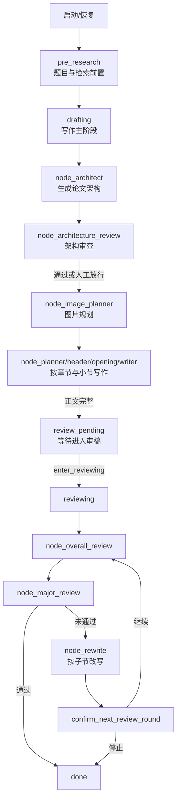

# ThesisLoom

ThesisLoom 是一个面向论文写作的本地化人机协作系统。它不是“一次性生成全文”的黑盒工具，而是一条可观察、可暂停、可恢复、可人工决策的写作工作流。

本 README 面向首次接触 ThesisLoom 且只使用 release 安装包的用户。

## ThesisLoom 能做什么

1. 组织论文写作流程：从前置准备、写作到审稿改写，全流程可追踪。
2. 支持输入大量异构资料：已有正文、笔记、相关工作、写作偏好、改稿要求都可纳入同一项目。
3. 自动生成草稿并分节推进：按章节和小节逐步写作，避免一次性失控输出。
4. 生成时动态决策上下文：按当前阶段和目标节点挑选最相关信息，而不是无差别拼接全文上下文。
5. 支持人工介入关键决策：例如是否开启检索、是否进入下一轮审稿。
6. 保留断点和过程记录：中断后可继续，不必从头重来。
7. 支持自定义写作与修改要求：可分别配置全局写作偏好与审稿改写指令。

## ThesisLoom 的优势

1. 可控：关键环节由你确认，而不是全自动“跑到底”。
2. 可恢复：基于 checkpoint 自动续跑，适合长时任务。
3. 可观测：当前阶段、节点、待操作动作、日志都可查看。
4. 上下文更高效：通过动态上下文选择，减少无效上下文长度，突出高价值信息。
5. 质量更稳定：在更短上下文内保留关键信息，提高生成质量与一致性。
6. 本地运行：数据与流程在本机执行，便于隐私与项目隔离。

## 适合谁使用

1. 需要结构化推进论文写作的研究生、科研人员。
2. 需要在自动化与人工把控之间取得平衡的写作者。
3. 希望使用桌面安装包直接开始，而不想先搭建开发环境的用户。

## 工作流原理（可视化）

主阶段为：

pre_research -> drafting -> review_pending -> reviewing -> done

对应的执行逻辑可以理解为下面这张图：



## 核心设定（架构输出与审稿循环）

### 1. 架构输出到底是什么

1. node_architect 会生成结构化 outline，而不是一段自由文本。
2. 每个大章节会带 writing_order，保证后续写作顺序可控。
3. 每个子节会带 sub_chapter_id，后续 writer/rewrite 用它精确定位改写目标。
4. node_architecture_review 会给出 issues、summary、improvement_actions。
5. 只要存在 high 严重问题就不会自动通过；仅中低优问题可人工 set_architecture_force_continue 放行。
6. 架构审查有轮次上限，最后一轮会自动采纳结果，避免架构阶段无穷循环。

### 2. 审稿循环是怎么设计的

1. 进入 reviewing 前，必须先经过 review_pending 的人工确认 enter_reviewing。
2. 每一轮固定顺序：overall_review -> major_review -> rewrite(按子节) -> 人工确认下一轮。
3. 每轮会输出 review_round_*.json 审稿报告，并保存版本化快照，方便回看和回滚。
4. 如果审稿未通过但没有返回可改写子节，会提前结束，避免空转。
5. 系统审稿安全上限固定为 20 轮，超过后停止自动循环并等待人工复核。

### 3. 可恢复与人工决策机制

1. 启动默认可暂停，继续时从 checkpoint 恢复，不会无脑从头重跑。
2. 关键节点持续写入 runtime、events、checkpoint，前端可实时看到状态。
3. 出现 pending action 时必须人工选择，流程才会继续推进。

## 实现逻辑（简要）

1. 桌面端启动后自动拉起本地后端。
2. 后端同时运行 API 服务和 workflow 状态机线程。
3. workflow 按阶段执行，并在关键节点写入 checkpoint、runtime、events。
4. 在每个节点执行前，系统按任务目标动态选择上下文来源（已写内容、输入资料、改稿要求等），优先注入高价值信息。
5. 前端持续读取状态；当出现 pending action 时，你在界面点选动作，后端继续执行。
6. 暂停后会在安全节点停下，继续时从最近 checkpoint 恢复。

## Release 版本快速开始

1. 从 Releases 下载并安装 Windows 安装包（msi 或 exe）。
2. 启动 ThesisLoom 桌面程序。
3. 在输入页填写主题、语言、模型和密钥配置。
4. 点击继续，按界面提示完成前置确认。
5. 在流程页观察执行进度，并在待确认节点进行人工决策。

## 本地源码运行（无需打包）

如果你不需要 MSI/EXE，只想在本地直接运行代码，推荐下面两种方式。

### 方式 A：Python 后端 + Vite 前端（推荐调试）

1. 安装 Python 依赖（仓库根目录执行）：

```powershell
pip install -r requirements.txt
```

2. 启动后端（仓库根目录执行）：

```powershell
python main.py --host 127.0.0.1 --port 18765 --interaction web
```

3. 启动前端（新开终端，`desktop_ui` 目录执行）：

```powershell
npm install
npm run dev -- --host 127.0.0.1 --port 1510
```

4. 浏览器打开 `http://127.0.0.1:1510`。

说明：前端默认请求后端 `http://127.0.0.1:18765`，与上述命令一致。

### 方式 B：Tauri 开发模式（桌面窗口）

1. 先准备 Rust 工具链（需可用 `cargo`）。
2. 在 `desktop_ui` 目录执行：

```powershell
cd desktop_ui
npm install
npm run tauri dev
```

该模式用于本地桌面调试，不会生成安装包。

### 常见问题

1. 端口被占用：请先释放 `18765`（后端）和 `1510`（前端），或改命令中的端口并保持前后端一致。
2. 前端连不上后端：确认后端日志出现 `Backend running at http://127.0.0.1:18765`。
3. 流程默认暂停：这是预期行为，需在前端点击继续后才会进入实际节点执行。

## README 与 docs 的分工

1. README：面向新用户与 release 使用场景，只保留上手必需信息。
2. docs：面向深入理解和开发参与，包含架构、状态机细节、构建打包等内容。

推荐继续阅读：

1. docs/workflow_stage_architecture.md
2. docs/build_and_package.md
