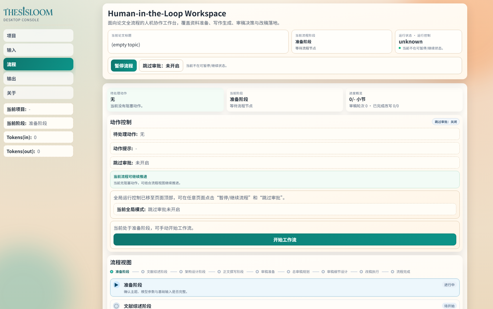
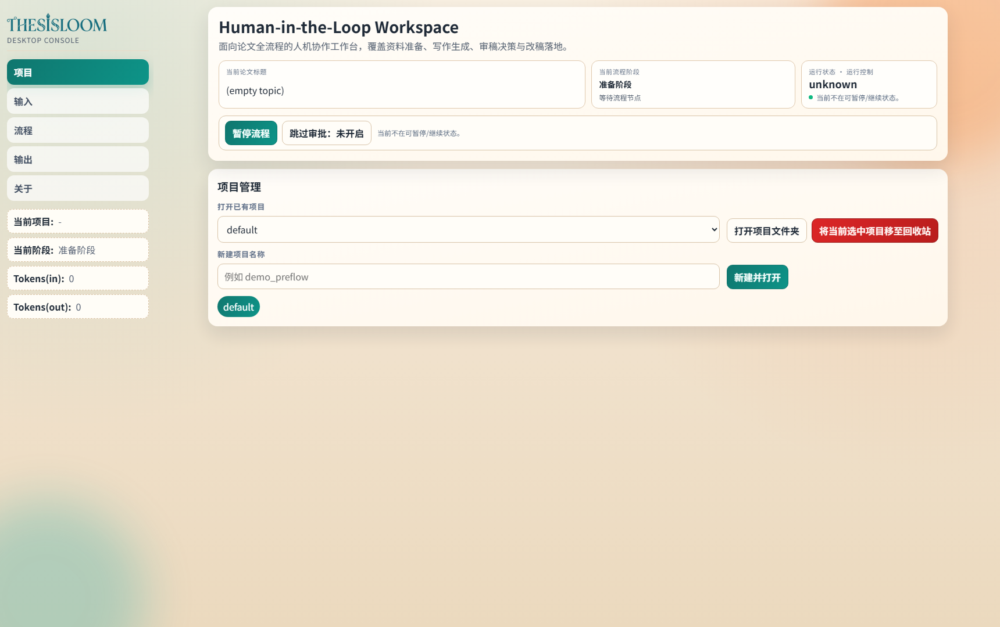
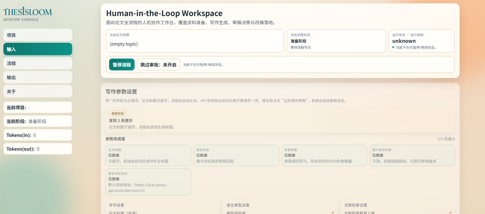
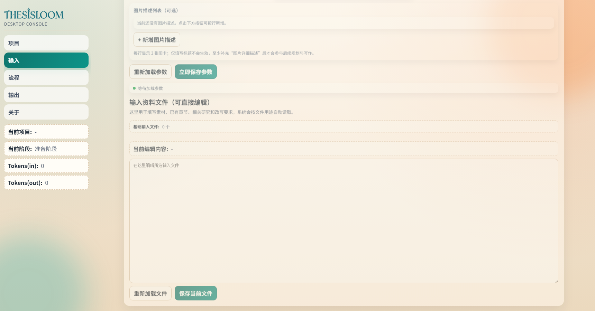
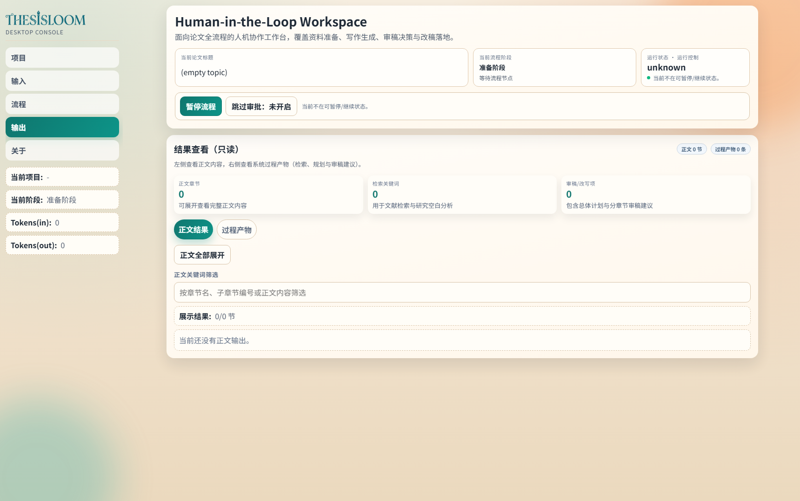
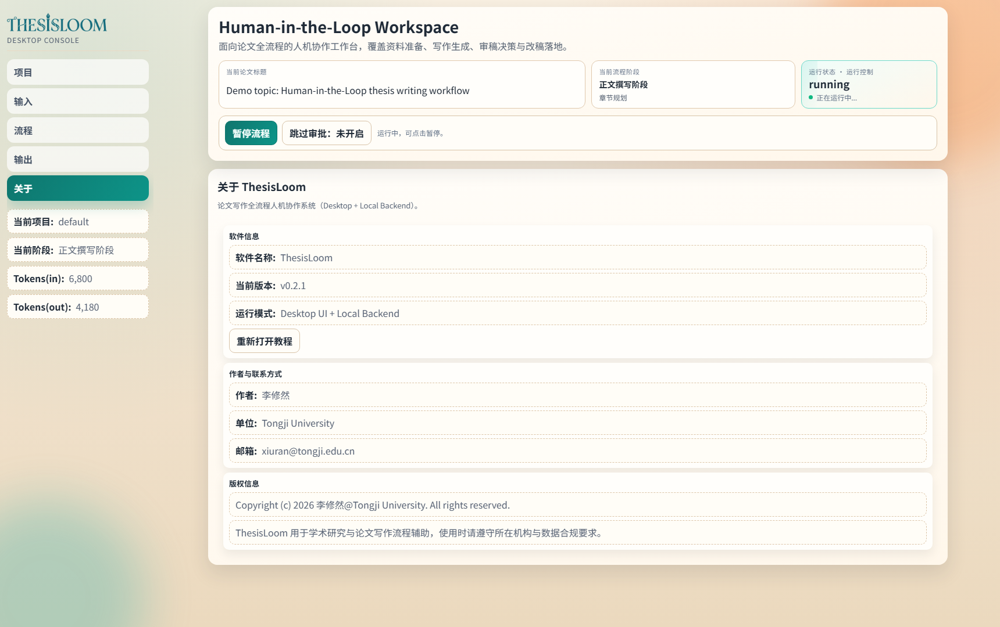

# ThesisLoom Desktop 页面导览（v0.2.1）

本文档基于当前桌面前端页面截图，介绍各页面用途，并给出后续迭代计划。

## 1. 流程页（Workflow）

- 用途：查看当前阶段、待处理动作、流程推进按钮与流程图。
- 关注点：顶部运行控制已全局化，可在任意页面进行暂停/继续与审批模式切换。

## 2. 项目页（Projects）

- 用途：切换项目、新建项目、打开项目目录、移至回收站。
- 关注点：当前保留了危险操作按钮（移至回收站），建议后续补充更强提示与二次确认文案。

## 3. 输入页（Inputs）

### 3.1 参数区（默认视图）

- 用途：设置论文主题、模型、检索参数、图片描述等核心输入。
- 状态：参数区不折叠，保持可见，便于快速校验后启动流程。

### 3.2 输入文件编辑区（含可折叠模板）

- 新增能力：Guidance 与 Review 模板区为默认折叠状态。
- 模板来源：
  - inputs/guidance/overall_guidance.md
  - inputs/review/overall_review.md
- 使用方式：
  - 在“输入资料文件（可直接编辑）”中展开对应折叠区。
  - 选择模板文件后直接编辑并保存，作为后续写作/审稿提示词输入。

## 4. 输出页（Outputs）

- 用途：查看正文结果和过程产物（检索、规划、审稿建议）。
- 关注点：目前空态提示较弱，后续可增加“下一步建议动作”。

## 5. 关于页（About）

- 用途：查看版本、运行模式、作者信息，并支持重新打开教程。

## 基于截图的不足与下一步迭代计划

### P0（下一次迭代，优先处理）

1. 输入页信息层级仍偏重：参数区内容很长，用户需要滚动到下半区才能看到输入文件编辑区。
2. 运行状态可解释性不足：顶部出现 unknown 时，用户不易判断是后端未连接、流程未启动还是异常状态。
3. 模板折叠区可发现性一般：虽然已默认折叠，但入口仍在页面下半区，首次用户不容易发现。

对应改进建议：

- 给输入页增加“右侧锚点目录”或“顶部分段跳转”（参数设置 / 文件编辑 / 模板区）。
- 在运行状态旁增加“状态解释 + 一键诊断”入口（检测后端、端口、状态文件）。
- 在参数区附近增加“模板快捷入口卡片”，点击可直接跳转并自动展开 Guidance/Review 区块。

### P1（第二阶段）

1. 项目页的危险操作（回收站）与常规操作靠得较近，误触风险仍然存在。
2. 输出页空态缺少明确路径，用户不知道“先做什么才能出现结果”。
3. 关于页信息偏静态，缺少运行健康度与关键链接聚合。

对应改进建议：

- 项目页增加危险操作隔离区和输入项目名确认。
- 输出页加入“空态向导”：去输入页补充参数 -> 启动流程 -> 返回查看。
- 关于页增加诊断卡片（后端状态、日志路径、最近错误摘要）。

### P2（第三阶段）

1. 页面视觉节奏偏均匀，重点区域不够突出。
2. 大量表单与状态卡在长页面中容易造成视觉疲劳。

对应改进建议：

- 增强重点动作区（开始流程、保存参数、待处理动作）的视觉优先级。
- 对高频卡片增加密度模式切换（舒适/紧凑），提升长时间使用体验。
